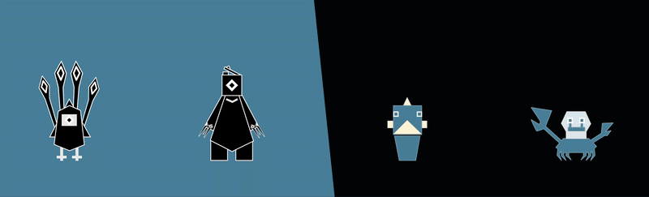
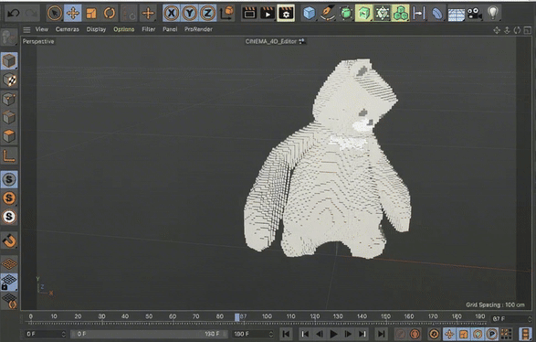

# 00. Project Video
<!-- placeholder: video_hero -->

---

**Tools Used:** Unity · Vuforia · Cinema 4D · Illustrator · C# · Animator State Machine  

---

## 1. Overview

**Personal Carbon Neutral** is an AR game prototype that transforms a player’s real-world carbon footprint into interactive digital creatures.  
The project integrates AR, environmental data, and game mechanics to explore how emerging technology can drive sustainable behavior through play.

---

## 2. Problem

Carbon emissions are invisible and abstract, making them difficult for individuals to understand or act on.

Even people who want to behave sustainably often lack:

- Real-time feedback  
- Behavioral insight  
- An engaging reason to change habits  

**Design challenge:**  
How can technology make personal carbon impact visible, actionable, and emotionally meaningful?

---

## 3. Concept

The game visualizes carbon emissions as creatures that players can interact with and transform through sustainable actions.

### SCM – Small Carbon Monsters  
SCMs are formed from a player’s daily carbon emissions.  
Players can **purify** SCMs to reduce their footprint and add them to a creature collection for future battles.

### LCM – Large Carbon Monsters  
LCMs are generated from the **combined emissions of all players in a city**.  
Defeating an LCM symbolizes achieving **temporary collective carbon neutrality**.

This system reframes climate responsibility into a **playable loop** where real-world actions create in-game power.

---

## 4. System & Mechanics

### Behavior Tracking  
The system gathers emission-related actions through two channels.

#### Auto-detected behaviors (AI pattern recognition)

By analyzing movement rhythm and route patterns, the system can infer transport type:

- Walking  
- Biking  
- Bus routes  
- Subway travel  
- Taxi / ride services  

_Concept: public transit follows fixed routes + consistent speeds; other modes have distinct patterns, making classification possible._

#### Manually verified behaviors
Actions requiring simple proof uploads include:

- Recycling  
- Energy-saving habits  
- Conscious or low-impact shopping  
- Sustainable diet choices  

To motivate these actions, players unlock **mini-games** that reinforce sustainable habits.

---

### Reward Loop

Sustainable behaviors convert into in-game value:

- **Coins** – unlock skins  
- **Magic power** – used in combat  
- **EXP** – upgrades and evolves characters  
- **City progress** – contributes to defeating LCMs  

This creates a **closed feedback system** where physical actions directly affect digital outcomes.

---

## 5. Character Design

### Main Character – Whale Willy  
Inspired by whales as natural **carbon sinks**.  
Willy’s appearance evolves based on the player's activity and progress.

### SCM Monsters

SCM creatures represent everyday environmental issues.

**Bird Billy in petroleum**  
**Crab Craddock in a plastic shell**  
**Fish Fellah tangled in a nest**  
**Bear Bell with its head in a gasoline can**

### LCM Monster – Giant Salamander  
A boss creature inspired by **extreme flood events** and ecosystem vulnerability.

Each character anchors a real climate issue through playful, approachable visual storytelling.

---

## 6. Technical Build

### 6.1 Modeling & Visual Exploration (Cinema 4D)

I initially explored a **voxel-style particle system** using Tool 4D Voxygen to visualize characters as “carbon particles.”  
Although visually intriguing, this approach created:

- Unstable motion during FBX export  
- High-frequency visual noise causing AR discomfort  
- Poor readability in small real-world environments  

To improve usability and performance, I transitioned to **cleaner 3D models** with strong silhouettes, while maintaining carbon-inspired design cues.

_Tools: Cinema 4D, Voxygen plugin_

---

### 6.2 AR Prototype Development

In Unity, I built two AR battle prototypes that integrate animation, interaction logic, and spatial mapping.

- C# battle logic  
- Animator state machine  
- Vuforia plane detection  
- Real-world player movement mapped to combat distance  

